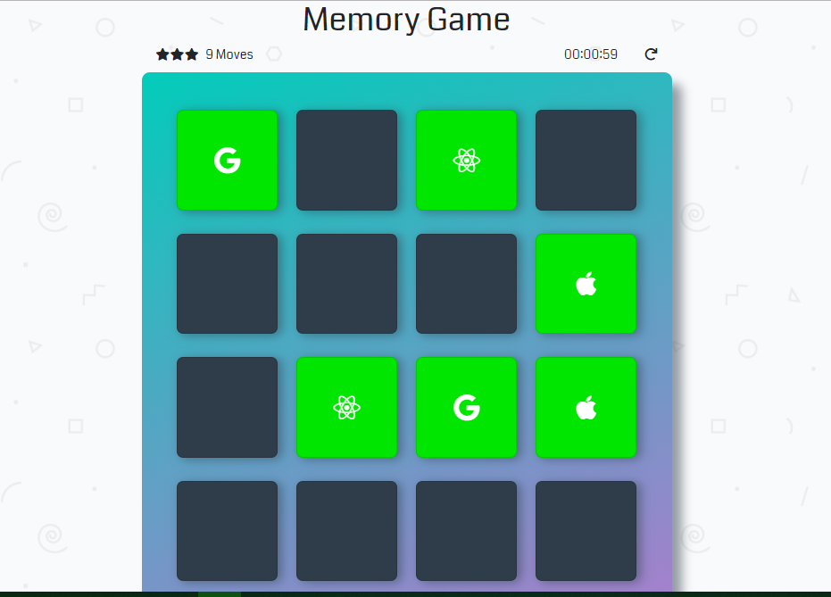

# Memory-Game

* The player clicks on one card to reveal its symbol.
* Then the player clicks on another card to find the card with the same symbol.
* If all cards have been correctly matched, the player wins.

## Live Demo : https://fend-memorygame.herokuapp.com/

## How to Run this Web Application Locally,
* Clone this repository `git clone git@github.com:Soumya44/MemoryGame.git`
 <b>OR</b> Download Zip from <a href="https://github.com/Soumya44/MemoryGame/archive/master.zip">https://github.com/Soumya44/MemoryGame/archive/master.zip</a>
* Locate `index.html` inside the parent Folder named `MemoryGame-master`
* Open the `index.html` file in your preferred browser
* Enjoy the Game !!! :+1:

<h3 align=center>Screenshots</h3>

 
 
<h3>Technology Used (Dependencies) :</h3>

* <a href="https://getbootstrap.com/">Bootstrap v4.1</a>
* <a href="https://fontawesome.com/">FontAwesome v5.1.1</a>
* <a href="https://fonts.google.com/">Google Fonts</a>
* <a href="https://daneden.github.io/animate.css/">animate.css v3.5</a>
* <a href="https://jquery.com/">jQuery v3.3.1</a>
* <a href="https://popper.js.org/">Popper v1.14</a>
* <a href="https://albert-gonzalez.github.io/easytimer.js/">easytimer.js</a>
 
<h3 align=center><b>Made with :sparkling_heart: by <a href="https://linkedin.com/in/soumya-ranjan-behera-989a2a151/">Soumya</b></h3>
